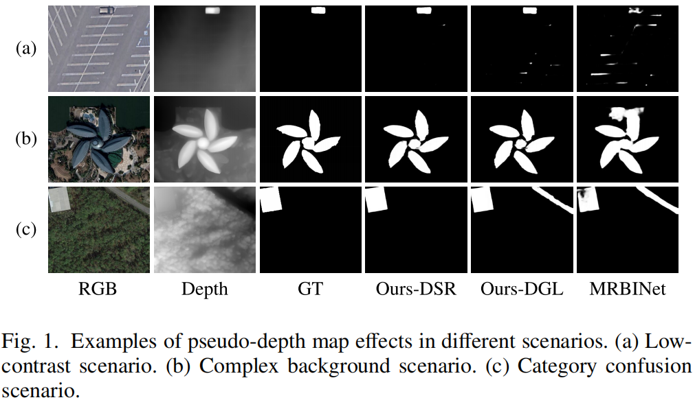
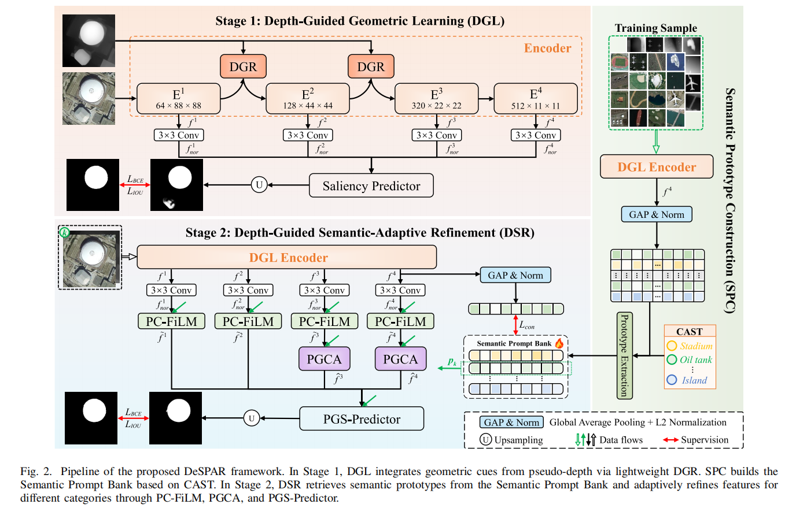
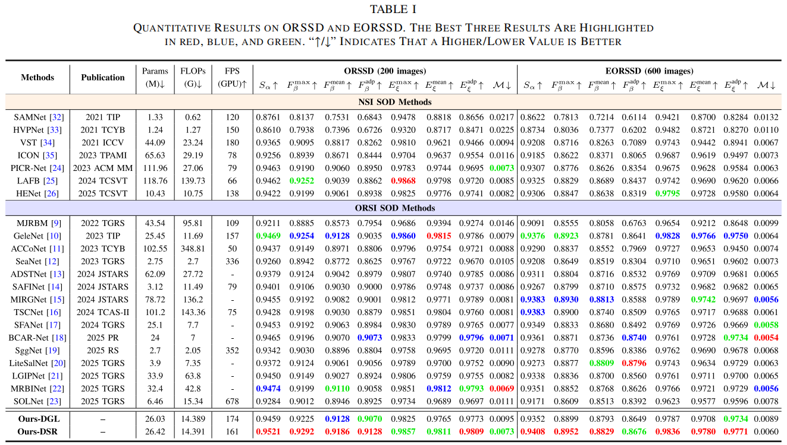
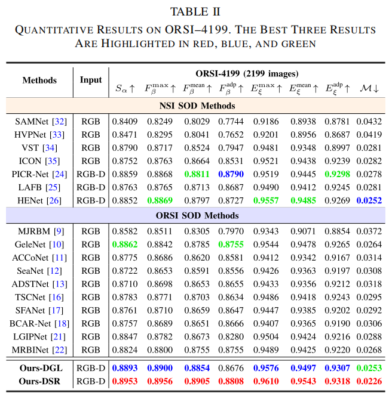

<div align="center">

# DeSPAR

[](https://pytorch.org/)
[](https://onnx.ai/)
[](https://opensource.org/licenses/MIT)
<br>
**English** | [**简体中文**](README_zh-CN.md)

</div>

> **This is the official PyTorch implementation and deployment codebase for the IEEE TGRS accepted paper "[DeSPAR: Depth-Guided Semantic-Prompted Adaptive Refinement for ORSI Salient Object Detection](https://ieeexplore.ieee.org/document/11367015)".**

## 📖 Introduction

In Optical Remote Sensing Image (ORSI) Salient Object Detection, there are currently two core challenges:
1. **Limited Spatial Perception:** Relying solely on the RGB modality under extreme imaging conditions (as shown in Fig. a and b) makes it difficult to acutely perceive the geometric convexities and spatial layout of objects, leading to less robust spatial structure representations.
2. **Semantic Feature Confusion:** The features of objects and complex backgrounds in remote sensing images are highly coupled. Single-modality methods are highly prone to category confusion (as shown in Fig. c, MRBINet misdetects roads, which have similar texture and morphology, as salient buildings).

<p align="center">
  
</p>

To break through this bottleneck, we propose **DeSPAR**—an innovative **Geometry-Semantic Decoupled Progressive Refinement Framework**. This framework specifically introduces **depth geometric priors** to overcome spatial perception limitations, and combines **category semantic prompts** to completely eliminate feature confusion. To perfectly fuse these two heterogeneous types of information, DeSPAR abandons traditional joint training and adopts a progressive decoupled feature extraction strategy, ultimately achieving highly robust and precise detection.

**Performance:** DeSPAR surpasses **26** SOTA methods across 3 public ORSI-SOD benchmarks (ORSSD, EORSSD, ORSI-4199).


## 🧠 Core Methodology

When simultaneously introducing depth geometric priors and semantic constraints, the most intuitive approach is End-to-End joint training. However, this causes a severe **Optimization Conflict**: due to the pre-training advantage of the backbone, strong semantic classification signals converge extremely fast and dominate the gradient update direction, causing the network to "take shortcuts" and ignore the construction of a fragile geometric foundation.

To resolve this conflict, DeSPAR ingeniously splits the feature learning process into two progressive stages:

<p align="center">
  
</p>

* 💠 **Efficient Backbone:** Utilizes PVTv2 as the encoder. By leveraging its spatial-reduction attention mechanism, it effectively extracts global context while maintaining a reasonable computational complexity for high-resolution remote sensing images.

* 🧱 **Stage 1: Depth-Guided Geometry Learning (DGL):** Focuses on building a universal geometric foundation. Through a novel lightweight **Depth-Guided Refiner (DGR)**, it uses RGB features to guide pseudo-depth denoising and reversely injects pure geometric cues, significantly enhancing the model's representation capabilities for object spatial structures.
* 🎯 **Stage 2: Depth-Guided Semantic-Adaptive Refinement (DSR):** Focuses on imposing category-specific semantic constraints. Inheriting the DGL geometric foundation (weights), it utilizes a constructed **Semantic Prompt Bank** to adaptively optimize the features of different categories through a prompt-guided mechanism, effectively resolving semantic feature confusion caused by morphological differences.


## 🚀 Engineering Highlights

This repository provides not only the academic reproduction code but also a comprehensive refactoring specifically aimed at **algorithm deployment and edge-side implementation**:

* **⚡ Ultra-lightweight & High FPS:** The model has only **26.4M** parameters. Under native PyTorch, the inference speed reaches **161 FPS**, showing immense potential for edge deployment.

* **📦 Zero-Barrier ONNX Deployment:** Fully supports ONNX static computational graph export with dynamic axes. It resolves `pixel_unshuffle` operator compatibility issues via underlying `Monkey Patching` and includes built-in double-blind precision alignment testing (error `< 1e-4`).
* **🔗 Robust Cascaded Inference Engine:** The inference demo script features a built-in monocular depth estimation interface (powered by Depth-Anything-V2). Even in blind-test scenarios without depth map inputs, DeSPAR still outputs precise predictions relying on the powerful denoising and anti-interference capabilities of the DGR module.


## 🛠️ Getting Started

### 1. Environment Requirements
This project is built on PyTorch 1.8+ with minimal core dependencies. Run the following commands to configure the environment:
```bash
conda create -n despar python=3.8
conda activate despar
pip install -r requirements.txt
```

### 2. Data & Weights Preparation
To ensure an incredibly smooth out-of-the-box experience, the dataset category labels (`annotations/*.npy`) are already built into this repository. You only need to download the image files and related model weights:

1. **Download Model Weights:** * **DeSPAR Core Weights:** [📦 Download weights.zip](https://github.com/YourUsername/DeSPAR/releases/download/v1.0.0/weights.zip), and extract it to the project root directory. *(Note: Replace with your actual release link after uploading)*
   * **Depth-Anything Weights (For blind-test inference only):** [📥 Download depth_anything_v2_vitb.pth](https://huggingface.co/depth-anything/Depth-Anything-V2-Base/resolve/main/depth_anything_v2_vitb.pth?download=true) and place it in the `Depth-Anything-V2/checkpoints/` directory.
2. **Download Datasets:** Please get the core image data of `ORSI-4199` (including Image, GT, Depth) from [Baidu Netdisk](Link).
3. **Organize Directory:** Ensure your project root structure looks like this:

<details>
<summary>📂 <b>Click to expand the Project Structure</b></summary>

```text
DeSPAR/
├── assets/                 
│   └── examples/           # Demo test images
├── configs/                # Configuration files (stage1/stage2)
├── data/
│   └── ORSI-4199/          # ORSI-4199 dataset directory
│       ├── annotations/    # Category label files (Built into GitHub)
│       │   ├── ORSI-4199_train_cls.npy
│       │   └── ORSI-4199_test_cls.npy
│       ├── train_Image/    
│       ├── train_GT/       
│       ├── train_Depth/    
│       ├── test_Image/     
│       ├── test_GT/        
│       └── test_Depth/     
├── datasets/
├── Depth-Anything-V2/
│   └── checkpoints/
│       └── depth_anything_v2_vitb.pth  # Depth estimation weights for blind testing
├── models/                 # Core network architecture
├── tools/                  # Scripts for training, testing, and inference
├── weights/                # Directory for pre-trained weights
│   ├── pvt_v2_b2.pth
│   ├── prompt_centers_ORSI-4199.npy
│   ├── stage1_ORSI-4199/
│   │   ├── despar_stage1_best.pth
│   │   └── despar_stage1.onnx     # Exported ONNX model
│   └── stage2_ORSI-4199/
│       ├── despar_stage2_best.pth
│       └── despar_stage2.onnx     # Exported ONNX model
└── requirements.txt
```
</details>

## 🚀 Quick Start: Inference & Deployment

We provide an extremely powerful and out-of-the-box `demo.py` inference script, featuring an **Intelligent Routing** and **Blind-Test Cascading** mechanism:
* **Intelligent Routing:** When a `--label` is specified, the script automatically loads the **Stage 2 (DSR)** model for semantic-adaptive precise detection; if no label is provided, it falls back to the **Stage 1 (DGL)** model for category-agnostic universal salient detection.
* **Blind Testing Without Depth:** Even without providing a `--depth` map, the script seamlessly calls the built-in engine (powered by Depth-Anything-V2) to generate a pseudo-depth map, perfectly handling real-world deployment scenarios.

### 1. Supported Semantic Class Map
When using Stage 2 for semantic-guided inference, the following 11 remote sensing salient object categories are supported:
`stadium`, `aircraft`, `road`, `oil_tank`, `car`, `urban_landmark`, `ship`, `river`, `rural_building`, `lake`, `bridge`.

### 2. Cascaded Inference Demo
We have pre-loaded test images covering all categories in the `assets/examples/` directory. You can directly copy the commands below to experience the highly precise segmentation results (the script will automatically save the predictions and blended visual overlays):

**Mode A: Semantic-Guided Precise Detection (Calls Stage 2 - Recommended)**
```bash
python tools/demo.py --img 'assets/examples/2013.jpg' --label aircraft
python tools/demo.py --img 'assets/examples/2198.jpg' --label road
python tools/demo.py --img 'assets/examples/cars_MSO_ (41).jpg' --label car
python tools/demo.py --img 'assets/examples/2229.jpg' --label ship
```
*(Note: The assets/ directory also contains images for stadium, oil_tank, river, rural_building, urban_landmark, lake, bridge. Feel free to swap them into the commands above for a full experience.)*

**Mode B: Category-Agnostic / Zero-Shot Detection (Calls Stage 1)**
When facing unknown categories of remote sensing images, simply omit the label parameter to test the model's universal generalization capability:
```bash
python tools/demo.py --img 'assets/2198.jpg'
```

### 3. ONNX Export & Precision Verification
To conquer the last mile of edge deployment, we provide a standard industrial-grade export and verification pipeline, fully supporting dynamic axis export for both Stage 1 and Stage 2 models.

**Step 1: Model Export**
Use the following commands to seamlessly export the trained PyTorch weights into `.onnx` computational graphs:
```bash
python tools/export_onnx.py --stage 1  # Export Stage 1 universal geometric detection model
python tools/export_onnx.py --stage 2  # Export Stage 2 semantic-guided refinement model
```

**Step 2: Double-Blind Precision Alignment Testing**
After exporting, it is highly recommended to use our verification script to test the output error between PyTorch and ONNXRuntime under identical inputs to ensure operator-level alignment:
```bash
python tools/verify_onnx.py --stage 1
python tools/verify_onnx.py --stage 2
```
*In our testing environment, the Max Absolute Difference between PyTorch and ONNX is well below the `1e-4` level, achieving a perfect lossless conversion.*


## ⚙️ Training & Evaluation

This project adopts a progressive decoupled training paradigm. Please strictly follow these three steps:

**Step 1: Train Stage 1 (DGL Geometric Foundation Construction)**
```bash
python tools/train.py --config configs/stage1_dgl.yaml
```

**Step 2: Extract Semantic Prompt Centers (Crucial Step)**
Using the trained Stage 1 weights, extract the semantic clustering centers for various categories in the dataset:
```bash
python tools/build_prompt_bank.py
```

**Step 3: Train Stage 2 (DSR Semantic-Adaptive Refinement)**
```bash
python tools/train.py --config configs/stage2_dsr.yaml
```

**Model Evaluation**
```bash
python tools/test.py --config configs/stage2_dsr.yaml
```

## 📊 Quantitative Results

DeSPAR demonstrates outstanding performance across three major public benchmarks. To verify the model's robustness, we conducted extremely detailed comparative experiments: on the classic **ORSSD and EORSSD** datasets, we compared against **26** existing SOTA methods; simultaneously, on the more challenging large-scale dataset **ORSI-4199**, we conducted a comprehensive evaluation against **17** top-tier open-source methods, achieving state-of-the-art metrics across the board.

<p align="center">
  
</p>

<p align="center">
  
</p>

## 🤝 Citation

If you find this project helpful for your research or engineering deployment, please cite our paper and give this repository a ⭐ Star!

```bibtex
@article{zhang2026despar,
  title={DeSPAR: Depth-Guided Semantic-Prompted Adaptive Refinement for ORSI Salient Object Detection},
  author={Zhang, Xiaoli and Liufu, Ping and Hu, Xihang and Li, Xiongfei and Jia, Chuanmin and Ma, Siwei},
  journal={IEEE Transactions on Geoscience and Remote Sensing},
  year={2026},
  publisher={IEEE}
}
```


## 🙏 Acknowledgements

The success of this project is inseparable from the selfless contributions of the open-source community. We would like to express our special gratitude to the following excellent open-source works for providing foundational stones and inspiration:
* 💠 [PVTv2](https://github.com/whai362/PVT): Provided an extremely efficient visual backbone network for this project.
* 🌊 [Depth-Anything-V2](https://github.com/DepthAnything/Depth-Anything-V2): Provided powerful monocular depth estimation support for our depth-free blind testing inference demo.